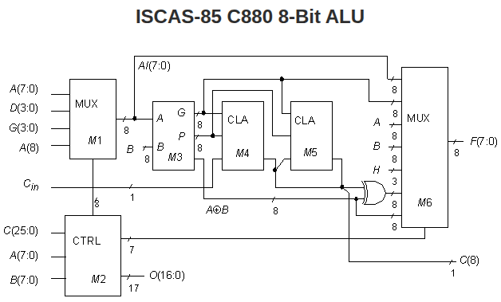

Circuit: [ISCAS C880](https://tumbleweed.nu/r/iscas.restore/doc/trunk/c880.html)

|I/O buses|Function|ISCAS-85 Netlist numbers|
|---|---|---|
|A[8:0]|Main A bus|91, 96, 101, 106, 111, 116, 121, 126, 268|
|B[7:0]|Main B bus|159, 165, 171, 177, 183, 189, 195, 201|
|C[25:0]|Control bus| 207, 135, 156, 90, 89, 88, 87, 86, 85, 80, 75, 74, 73,   72, 68, 59, 55, 51, 42, 36, 29, 26, 17, 13, 8, 1| 
|D[3:0]| 4-bit bus| 143, 146, 149, 153| 
|F[7:0]| Output function| 850,863,864,865,874,878,879,880| 
|G[3:0]| 4-bit bus| 8, 51, 17, 152| 
|C in| Carry in| 261| 
|C8| Carry out| 866

# I/O and gates
60 inputs (PI)
26 outputs (PO)
63 inverters 
320 gates ( 117 ANDs + 87 NANDs + 29 ORs + 61 NORs + 26 buffers )
? fanouts

# Total possible faults
|Fault model|Total possible faults|Calculation|
|---|---|---|
|Stuck-At Faults(SAF)|
|Transistor Faults|
|Open and short faults|
|Delay Faults and crosstalk|

# Controllability and observability

