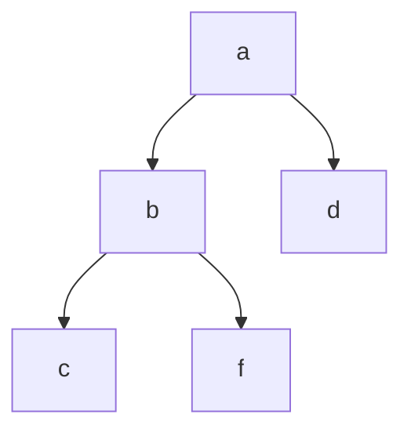

## Base meaning
|Value|Significance|
|---|---|
|0|false|
|1|true|
|X|Don't care|
|D|Composite logic value 1/0|
|$\overline{D}$|Composite logic value 0/1|

## AND Gate
### Forward implication table
Where a and b are inputs
|     **a \ b**    | **0** | **1** | **X** | **D** | **$\overline{D}$** |
| :--------------: | :---: | :---: | :---: | :---: | :--------------: |
|       **0**      |  `0`  |  `0`  |  `0`  |  `0`  |        `0`       |
|       **1**      |  `0`  |  `1`  |  `X`  |  `D`  |        $\overline{D}$       |
|       **X**      |  `0`  |  `X`  |  `X`  |  `X`  |        `X`       |
|       **D**      |  `0`  |  `D`  |  `X`  |  `D`  |        `0`       |
| **$\overline{D}$** |  `0`  |  $\overline{D}$  |  `X`  |  `0`  |        $\overline{D}$       |
### Tseitin Transform
Considering Z as output

$$\left( a+\overline{z}\right) \left( b+\overline{z} \right) \left( \overline{a}+\overline{b}+z \right)$$

## NAND Gate
### Forward implication table
|     **a \ b**    | **0** | **1** | **x** | **D** | **$\overline{D}$** |
| :--------------: | :---: | :---: | :---: | :---: | :--------------: |
|       **0**      |  `1`  |  `1`  |  `1`  |  `1`  |        `1`       |
|       **1**      |  `1`  |  `0`  |  `X`  | $\overline{D}$  |        `D`       |
|       **x**      |  `1`  |  `X`  |  `X`  |  `X`  |        `X`       |
|       **D**      |  `1`  |  $\overline{D}$  |  `X`  |  $\overline{D}$  |        `1`       |
| **$\overline{D}$** |  `1`  |  `D`  |  `X`  |  `1`  |        `D`       |
### Tseitin Transform
Considering Z as output

$$\left( a+z\right) \left( b+z \right) \left( \overline{a}+\overline{b}+\overline{z}\right)$$

## OR Gate
### Forward implication table
|     **a \ b**    | **0** | **1** | **x** | **D** | **$\overline{D}$** |
| :--------------: | :---: | :---: | :---: | :---: | :--------------: |
|       **0**      |  `0`  |  `1`  |  `X`  |  `D`  |        $\overline{D}$       |
|       **1**      |  `1`  |  `1`  |  `1`  |  `1`  |        `1`       |
|       **x**      |  `X`  |  `1`  |  `X`  |  `X`  |        `X`       |
|       **D**      |  `D`  |  `1`  |  `X`  |  `D`  |        `1`       |
| **$\overline{D}$** |  $\overline{D}$  |  `1`  |  `X`  |  `1`  |        $\overline{D}$       |
### Tseitin Transform
Considering Z as output

$$\left( \overline{a}+z\right) \left( \overline{b}+z \right) \left( a+b+\overline{z}\right)$$

## NOR Gate
### Forward implication table
|     **a \ b**    | **0** | **1** | **x** | **D** | **$\overline{D}$** |
| :--------------: | :---: | :---: | :---: | :---: | :--------------: |
|       **0**      |  `1`  |  `0`  |  `X`  |  $\overline{D}$  |        `D`       |
|       **1**      |  `0`  |  `0`  |  `0`  |  `0`  |        `0`       |
|       **x**      |  `X`  |  `0`  |  `X`  |  `X`  |        `X`       |
|       **D**      |  $\overline{D}$  |  `0`  |  `X`  |  $\overline{D}$  |        `0`       |
| **$\overline{D}$** |  `D`  |  `0`  |  `X`  |  `0`  |        `D`       |
### Tseitin Transform
Considering Z as output

$$\left( \overline{a}+\overline{z}\right) \left( \overline{b}+\overline{z} \right) \left( a+b+z\right)$$

## XOR Gate
### Forward implication table
|     **a \ b**    | **0** | **1** | **x** | **D** | **$\overline{D}$** |
| :--------------: | :---: | :---: | :---: | :---: | :--------------: |
|       **0**      |  `0`  |  `1`  |  `X`  |  `D`  |        $\overline{D}$       |
|       **1**      |  `1`  |  `0`  |  `X`  |  $\overline{D}$  |        `D`       |
|       **x**      |  `X`  |  `X`  |  `X`  |  `X`  |        `X`       |
|       **D**      |  `D`  |  $\overline{D}$  |  `X`  |  `0`  |        `1`       |
| **$\overline{D}$** |  $\overline{D}$  |  `D`  |  `X`  |  `1`  |        `0`       |
### Tseitin Transform
Considering Z as output

$$\left( \overline{a}+\overline{b}+\overline{z}\right) \left( a+b+\overline{z}\right) \left( a+\overline{b}+z\right) \left( \overline{a}+b+z\right)$$

## XNOR Gate
### Forward implication table
|     **a \ b**    | **0** | **1** | **x** | **D** | **$\overline{D}$** |
| :--------------: | :---: | :---: | :---: | :---: | :--------------: |
|       **0**      |  `1`  |  `0`  |  `X`  |  $\overline{D}$  |        `D`       |
|       **1**      |  `0`  |  `1`  |  `X`  |  `D`  |        $\overline{D}$       |
|       **x**      |  `X`  |  `X`  |  `X`  |  `X`  |        `X`       |
|       **D**      |  $\overline{D}$| `D`  |  `X`  |  `1`  |        `0`       |
| **$\overline{D}$** |  `D`  |  $\overline{D}$  |  `X`  |  `0`  |        `1`       |
### Tseitin Transform
Considering Z as output

$$\left( \overline{a}+\overline{b}+z\right) \left( a+b+z\right) \left( a+\overline{b}+\overline{z}\right) \left( \overline{a}+b+\overline{z}\right)$$

## NOT Gate
|     **a**    | **Output** |
| :--------------: | :---: | 
|       **0**      |  `1`  | 
|       **1**      |  `0`  | 
|       **x**      |  `X`  | 
|       **D**      |  $\overline{D}$|
| **$\overline{D}$** |  `D`  |  
### Tseitin Transform
Considering Z as output
$$\left( \overline{a}+\overline{z}\right) \left( a+z\right)$$

## BUFF gate
|     **a**    | **Output** |
| :--------------: | :---: | 
|       **0**      |  `0`  | 
|       **1**      |  `1`  | 
|       **x**      |  `X`  | 
|       **D**      |  `D`|
| **$\overline{D}$** |  $\overline{D}$  |  
### Tseitin Transform
Considering Z as output
$$\left( a+\overline{z}\right) \left( \overline{a}+z\right)$$

## Decision tree
